# Luobinsen 6th Generation Charger User Manual

 

     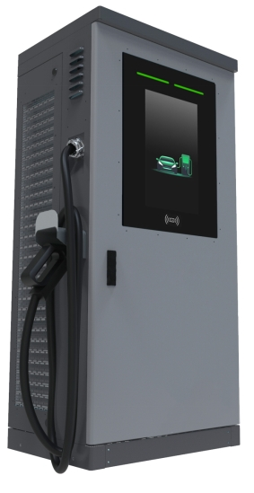
 

- Generation6 chargers introduction

- Installation Operation Manual

- Service Manual

 

You can contact me via email: [overseas@luobinsen.net](mailto:overseas@luobinsen.net)

## How to use the charger for the first time

- The charger should be installed according to the Installation Operation Manual

- Open the cover on the back of the screen

- A rechargeable battery needs to be installed, Rechargeable battery should be used, Battery type ML2032 is recommended. If the battery is not fitted and the charger has an incorrect date and time, you will need to enter the correct date and time each time the power is supplied.

    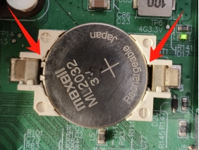

- If you want to connect the charger to the Central System, a public network cable or a SIM card or WIFI needs to be provided. The public network cable or SIM card needs to be installed on the back of the screen.

  <table>
      <tr>
      	<th>ethernet port</th>
          <th>SIM slot</th>
      </tr>
      <tr>
      	<td></td>
          <td></td>
      </tr>
  </table>

- Close the cover on the back of the screen

- Check that each component on the outside and inside of the charger has not been damaged

- Check all screws for no looseness, AC circuit breaker, AC contactor, AC copper row, DC contactor, fuse, shunt, charge gun, AC copper row.

- Measure the AC supply voltage between L1/L2/L3/N to meet the requirements of the charger, you can refer to the nameplate of the charger. The type of AC supply cable should be in accordance with the installation documentation of the charger.

- Turn on the main circuit breaker and all miniature circuit breakers

- Setting the date and time after the screen is on

- Connect the connector to the vehicle and try to start charging with the card

## Steps for connecting charger to the Central  System

 

Go to Network Parameters and change the following parameters

- Example 1: 
  - for a charge point with identity “CP001” connecting to a Central System with OCPP-J endpoint URL "ws://centralsystem.example.com/ocpp" this would give the following connection URL: ws://centralsystem.example.com/ocpp/CP001

    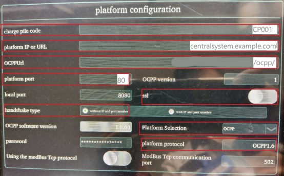

- Example 2: 
  - for a charge point with identity “RDAM 123” connecting to a Central System with OCPP-J endpoint URL "wss://centralsystem.example.com/ocppj" this would give the following URL:wss://centralsystem.example.com/ocppj/RDAM%20123

    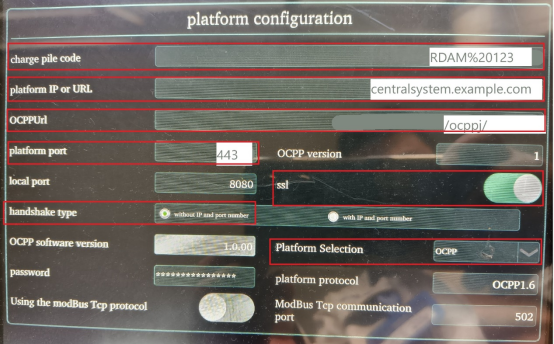

- Note: Both ends of the OCPPURL should contain “/”

- The reset button is in the manufacturer parameters

## Analysis and treatment of start-up failures

 

### there is voltage in battery

- Charger checks to vehicle battery voltage in standby condition, possible vehicle DC contactor damaged

- The CCM voltage is not accurate and the CCM AD voltage needs to be calibrated.

    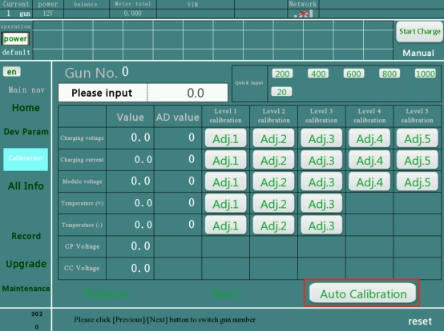

### insulation detection fault

- Check the insulation of the DC output of the charger

- Check the charging module

- The CCM voltage is not accurate and the CCM AD voltage needs to be calibrated.

    

### contactor not open

- Check the DC contactor

 

### 1802 telegram  time out

- Check and replace the SECC

- Check and replace the CCM

 

### 1806 telegram  time out

- Check and replace the SECC

- Check and replace the CCM

 

### battery reverse connected

- GBT charger not detecting vehicle battery voltage

 

### 1811 telegram  time out

- Check and replace the SECC

- Check and replace the CCM

 

### 1009

- Check and replace the SECC

 

### handshake time out

- Check and replace the SECC

 

### BMS other message time out

- Check and replace the SECC

 

### BMS other message time out 1

- Check and replace the SECC

 

### connector disconnect and terminated

- Disable “JIS insulation fast test”,Enable “Insulation detection enable”

    <table style="width: 100%; table-layout: fixed; border-collapse: collapse;">
        <tr>
        	<td style="width: 70%; padding: 8px; text-align: left; border: 1px solid black;">
            	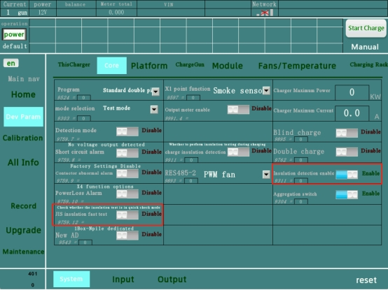
            </td>
            <td style="width: 30%; padding: 8px; text-align: left; border: 1px solid black;">
            	<ul>
                    <li>
                    	The AD board is a quick check board, select enable.
                    </li>
                    <li>
                    	AD board is not a fast detection board, select disable.
                    </li>
                    <li>
                    	Whether the AD is a quick check AD to see whether there is a white relay inside the AD board, without removing the shell, from the bottom to the inside, you can see it
                    </li>
                </ul>
            </td>
        </tr>
    </table>

### contactor not closed or short circuit fault

- Check the DC contactor

- The CCM voltage is not accurate and the CCM AD voltage needs to be calibrated.

 

### Abnormal detection voltage range

- The output voltage range of the charger（200-1000V） is not sufficient for the vehicle and the vehicle cannot be charged at this charger.

 

### old standard(GB/T & Local area) disabled charger not support

- The charger's communication protocol does not meet the vehicle

 

### SOC not reachable

- The charger's communication protocol does not meet the vehicle

 

### battery voltage higher than charger Max.output voltage

- The output voltage range of the charger（200-1000V） is not sufficient for the vehicle and the vehicle cannot be charged at this charger.

 

### Abnormal battery voltage - exceeding the current battery voltage range of BCP message

- The output voltage range of the charger（200-1000V） is not sufficient for the vehicle and the vehicle cannot be charged at this charger.

 

### control command stop

- CMS has sent a stop command to the charger, check the CMS

 

### Authentication failed

- User ID does not exist or is expired or frozen in CMS

 

### BMS start on fault

- Charger and vehicle communication error, try replacing the SECC

 

### over voltage fault

- Check charger output voltage

- The CCM voltage is not accurate and the CCM AD voltage needs to be calibrated.

 

### insulation detection boost failed

- Check that the charging module is working properly

- The CCM voltage is not accurate and the CCM AD voltage needs to be calibrated.

 

### The confirmation result of receiving the TCU message CMD12 from the State Grid is failed

- Replacement of TCU

 

### TCU normal stop

- Replacement of TCU

 

### TCU charge-control unit stop due to charging controler fault

- Replacement of TCU

 

### Communication failure between TCU charging control unit and charging controller

- Check CCM power supply

- Check and replace the network cable between the TCU and the CCM

- Replacement of CCM

 

### TCU card reader communication fault

- Check the card reader and its wiring harness

- Replacement of card reader

 

### Communication failure between TCU and Meter device

- Check meter power supply

- Replacement Meter

 

### TCUESAM fault

- Replacement of TCU

 

### TCU metering data verification is abnormal

- Check and replace DC energy meters

 

### TCU stop due to other faults

- For unknown reasons, please contact the supplier to check

 

### TCU communication abnormal

- Check and replace TCU

 

### Vehicle startup BRO message is abnormal

- Check and replace the SECC

 

### channel no charging TUTEL

- TUTEL-specific protocols

 

### connector charging stop

- Check the connection between the charging gun and the vehicle or replace the charging gun

 

### Emergency stop fault

- The emergency stop button has been pressed and there is no abnormality, please restore it.

 

### door open fault

- The door is open. Please close it.

- Check the door limit switches

 

### DC Metering communication fault

- Checking the power supply to the DC energy meter

- Check the communication harness of the DC energy meter

- Check DC meter address

    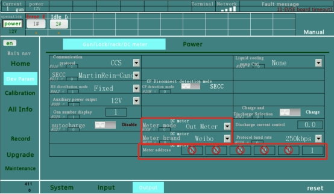

- Replacement of DC Meter

 

### communicate with CCM time out

- Check CCM power supply

- Check and replace the network cable between the TCU and the CCM

- Checking the parameters of the CCM

<table>
    <tr>
    	<td>
        	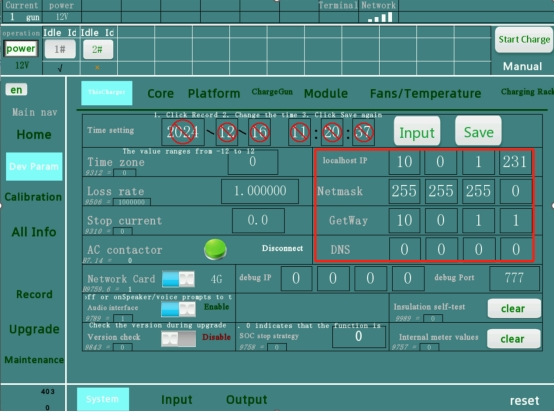
        </td>
        <td>
        	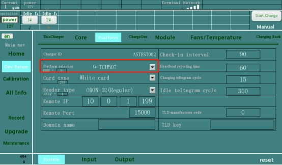
        </td>
    </tr>
</table>

- Replacement of CCM

 

### No charging fault

- Please contact the supplier to check

 

### Fuse fault

- Check fuses

 

### Lightning arrester fault

- Check or replace SPD

 

### Termial board abnormal

- Check FZ power supply

- Check FZ communication harness

- Replacement of FZ

 

### AC/DC controler fault

- Please contact the supplier to check

 

### aircondition controler fault

- Check the power supply to the air conditioning control board

- Check the communication harness of the air conditioning control board

- Replacement of air conditioning control board

 

### AD unit communicate module fault

- Check that the AD address is correct

- Check the power supply to the AD

- Check AD communication harness

- Replacement of AD

 

### all airconditioner fault

- Check all air conditioning power

- Check all air conditioning communication harnesses

- Maybe all the air conditioners are broken.

 

### Excessive wind speed

- The wind is too strong. Wait for the wind to die down.

- The anemometer's broken.

 

### main breaker electrical operator fault

- The main breaker is broken, it needs to be replaced.

 

### SDV fault

- The SDV is broken, it needs to be replaced.

 

### Metering device fault

- Replacement of DC energy meters

 

### main breaker electrical operator no power supply operation fault

- Check the power supply to the main circuit breaker

- The main breaker is broken, it needs to be replaced.

 

### on maintenance

- The charger is in service mode, note the position of the service button

 

### FLASH fault

- The flash board in the middle of the CCM is damaged and needs to be replaced.

 

### RAM fault

- The flash board in the middle of the CCM is damaged and needs to be replaced.

 

### SECC_PLC communication fault

- Check the power supply of the SECC

- Checking the communication cable between SECC and CCM

- Replacement SECC

 

### Parallel contactor fault or module terminal voltage abnormality

- Check or replace the intermediate contactor

- The CCM voltage is not accurate and the CCM AD voltage needs to be calibrated.

 

### smoke sensor fault

- Fire or smoke in the cabinet

- The smoke detector is broken.

 

### eletrical locker fault

- GBT charging gun electronic lock abnormality

 

### temperature of cabinet high fault

- High temperature inside the cabinet, need to stop and cool the charger

- The temperature sensor is broken

 

### channel specific remote control time out

- Please contact the supplier to check

 

### Real-time clock RTC fault

- The TCU's battery needs to be installed

- Time needs to be calibrated.

- TCU is damaged, please replace the TCU

 

### CCM enters start charging

- Charger and vehicle communication is in progress, please wait

 

### CCM enters charging time out

- Communication failure between charger and vehicle

- Check and replace the SECC

 

### VIN Get failed

- Check AC power supply

- Check the AC contactor

- Check charging module

 

### output short circuit

- Charger output short circuit, please check whether the charger or vehicle is short-circuited

 

### input phase missing

- AC input phase sequence is wrong, please change the correct phase sequence

 

### input over voltage

- Input AC voltage higher than charger AC voltage range2

- Checking the parameters of the CCM

    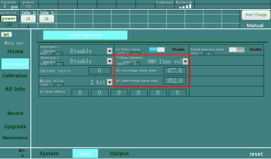

### input lower voltage

- Input AC voltage lower than charger AC voltage range

- Checking the parameters of the CCM

 

### communication of insulation module fault

- Please contact the supplier to check

 

### input insulation fault

- Please disconnect the power and check the input insulation

 

### BMS communcation module fault

- Please contact the supplier to check

 

### Fire alarm

- Please check the fire extinguisher.

 

### other unkown reason

- Please contact the supplier to check

 

### Electronic lock feedback abnormality

- Charging gun electronic lock abnormality, please replace the charging gun

 

### DC contactor abnormality

- Damaged DC contactor, replace DC contactor

 

### DC pre charging fault

- Please check the charging module

- Please check the AD voltage value of the CCM and calibrate it

 

### Input insulation self-test abnormality

- The input insulation self-test board is abnormal, please replace it.

 

### Abnormal output insulation self check

- The output insulation self-test board is abnormal, please replace it.

 

### Manual shutdown during startup

- Stopped during startup

 

### Card swiping shutdown during startup

- Stopped by a swipe during startup

 

### Remote shutdown during startup

- Remote stop during startup

 

### Power loss

- Input power suddenly cut off

 

### Ground detection function communication failure

- Check the power supply to the ground detector

- Check the communication harness of the ground detector

 

### Ground fault

- Earth wire error, please check if the earth wire is firmly connected

 

### Phase loss alarm

- Check input for phase loss

 

##  Failure analysis and handling

 

### Emergency stop fault

- The emergency stop button has been pressed and there is no abnormality, please restore it.

 

### Parallel contactor fault or module terminal voltage abnormality

- Check or replace the intermediate contactor

- The CCM voltage is not accurate and the CCM AD voltage needs to be calibrated.

 

### DC Metering communication fault

- Checking the power supply to the DC energy meter

- Check the communication harness of the DC energy meter

- Check DC meter address

 

### communicate with CCM time out

- Check CCM power supply

- Check and replace the network cable between the TCU and the CCM

- Checking the parameters of the CCM

 

### temperature of cabinet high fault

- High temperature inside the cabinet, need to stop and cool the charger

- The temperature sensor is broken

 

### CCS2 communication module fault

- Check the power supply of the SECC

- Checking the communication cable between SECC and CCM

- Replacement SECC

 

### door open fault

- The door is open. Please close it.

- Check the door limit switches

 

### No charging fault

- Please contact the supplier to check

 

### Fuse fault

- Check fuse

 

### Lightning arrester fault

- Check or replace SPD

 

### Termial board abnormal

- Check FZ power supply

- Check FZ communication harness

- Replacement of FZ

 

### AC/DC controler fault

- Please contact the supplier to check

 

### aircondition controler fault

- Check the power supply to the air conditioning control board

- Check the communication harness of the air conditioning control board

- Replacement of air conditioning control board

 

### AD unit communicate module fault

- Check that the AD address is correct

- Check the power supply to the AD

- Check AD communication harness

- Replacement of AD

 

### airconditioner fault

- Check the power supply to the air conditioner

- Check air conditioning communication harness

- Replacement of air conditioners

 

### Excessive wind speed

- The wind is too strong. Wait for the wind to die down.

- The anemometer's broken.

 

### main breaker electrical operator fault

- The main breaker is broken, it needs to be replaced

 

### SDV fault

- The SDV is broken, it needs to be replaced

 

### Metering device fault

- Replacement of DC energy meters

 

### abnormal operation without power supply

- Check that the AC contactor is closed

 

### maintenance status

- The charger is in service mode, note the position of the service button

 

### smoke sensor fault

- Fire or smoke in the cabinet

- The smoke detector is broken.

 

### eletrical locker fault

- GBT charging gun electronic lock abnormality,

- Replacement of charging gun

 

### Real-time clock RTC fault

- The TCU's battery needs to be installed

- Time needs to be calibrated.

- TCU is damaged, please replace the TCU

 

### CCM procedure fault

- Replacement of SECC

 

### output short circuit

- Charger output short circuit, please check whether the charger or vehicle is short-circuited

 

### input phase missing

- AC input phase sequence is wrong, please change the correct phase sequence

 

### input over voltage

- Input AC voltage higher than charger AC voltage range2

- Checking the parameters of the CCM

 

### input lower voltage

- Input AC voltage lower than charger AC voltage range

- Checking the parameters of the CCM

 

### communication of insulation module fault

- Please contact the supplier to check

 

### input insulation fault

- Please disconnect the power and check the input insulation

 

### BMS communcation module fault

- Please contact the supplier to check

 

### FLASH fault

- The flash board in the middle of the CCM is damaged and needs to be replaced.

 

### RAM fault

- The flash board in the middle of the CCM is damaged and needs to be replaced.

 

### Fire alarm

- Please check the fire extinguisher.

 

### other unkown reason

- Please contact the supplier to check

 

### Output contactor failure

- Check or replace the DC contactor

 

### Input insulation self check fault

- The input insulation self-test board is abnormal, please replace it.

 

### Output insulation self check fault

- The output insulation self-test board is abnormal, please replace it.

 

### Power loss

- Input power suddenly cut off

 

### Ground detection function communication failure

- Check the power supply to the ground detector

- Check the communication harness of the ground detector

 

### Ground fault

- Earth wire error, please check if the earth wire is firmly connected

 

### Phase loss alarm

- Check input for phase loss

 

 

 

## Analysis and handling of abnormal stop of transactions

### BMS time out

- Check and replace the SECC

- Check and replace the CCM

 

### Timeout or unknown reason process error

- Check and replace the SECC

- Check and replace the CCM

 

### BMS insulation fault

- Check the insulation of the DC output of the charger

- Check the charging module

 

### BMS output connector overtemperature

- Check charging gun temperature and replace charging gun

- Check if the vehicle's sockets are damaged, or that the sockets need to be replaced.

 

### BMS element output connector overtemperature

- Check charging gun temperature and replace charging gun

- Check if the vehicle's sockets are damaged, or that the sockets need to be replaced.

 

### BMS connector fault

- Check and replace charging gun

- Check if the vehicle's sockets are damaged, or that the sockets need to be replaced.

 

### BMS battery group temperater high

- Vehicle battery performance issues

 

### BMS other faults

- Please contact the supplier to check

 

### BMS over current

- Check charger output current

 

### BMS voltage abnormal

- Check charger output voltage

 

### BMS high voltage relay fault

- Damaged vehicle DC contactor

 

### BMS detection point fault

- Check that the charging gun is securely connected

 

### BMS reach request SOC

- Normal stop or vehicle SOC issues

 

### BMS reach total voltage setting value output over voltagve warning

- Check the AD voltage value of the CCM and calibrate it

 

### BMS reach unit voltage setting value

- Normal stops or battery performance problems

 

### BMS secondary alarm unit power battery voltage is too high

- Normal stops or battery performance problems

 

### BMS secondary alarm unit power battery voltage is too low

- Normal stops or battery performance problems

 

### BMS SOC too high

- Normal stops or battery performance problems

 

### BMS SOC too low

- Battery performance problems

 

### BMS charing over current

- Check charger output current

 

### BMS battery temperature too high

- Battery performance problems

- 

### BMS battery insulation abnormal

- Check charger or vehicle insulation

 

### BMS connection status abnormal

- Check that the charging gun is securely connected to the vehicle

- Replace the charging gun or vehicle socket

 

### BMS no charging or control point current too low for 10 minutes

- Low or no output current

- Check the DC contactor

- Check fuses

- Check AC power supply

- Check AC contactor

- Check charging module

- Check DC energy meter

 

### manually stop

- The stop button on the screen is pressed

 

### stop after reach request

- Full or battery performance issues

 

### stop of insufficient account

- Insufficient user balance, need to top up from CMS

 

### request voltage over Max.voltage

- The output voltage range of the charger（200-1000V） is not sufficient for the vehicle and the vehicle cannot be charged at this charger.

 

### request voltage lower than Min.voltage

- The output voltage range of the charger（200-1000V） is not sufficient for the vehicle and the vehicle cannot be charged at this charger.

 

### single battery unit over temperature

- Vehicle battery performance issues

 

### battery temperature too high

- Vehicle battery performance issues

 

### remote stop

- CMS controlled charging stop

 

### no charging current exceeds the allowed time

- Low or no output current

- Check the DC contactor

- Check fuses

- Check AC power supply

- Check AC contactor

- Check charging module

- Check DC energy meter

 

### swipe card to stop charging

- The card has been swiped to stop

 

### connector pull out to stop charging

- Connector disconnection stops during charging

- Check or replace the charging gun

 

### connector temperature too high

- Check or replace the charging gun

- Check the charging gun temperature from the parameter

 

### disconnect  connector

- Connector disconnection stops during charging

- Check or replace the charging gun

 

### stop of charger detect insulation failure

- Check the insulation of the DC output of the charger

- Check the charging module

### the confirmation result of receiving the State Grid TCU message CMD12 is Failed.

- Replacement of TCU

 

### TCU normal stop

- Replacement of TCU

 

### TCU charge-control unit stop due to charging controler fault

- Replacement of TCU

 

### Communication failure between TCU charging control unit and charging controller

- Check CCM power supply

- Check and replace the network cable between the TCU and the CCM

- Replacement of CCM

 

### Communication failure between TCU and Meter device

- Check meter power supply

- Replacement Meter

 

### TCUESAM fault

- Replacement of TCU

 

### TCU metering data verification is abnormal

- Check and replace DC energy meters

 

### stop of TCU other faults

- Please contact the supplier to check

 

### stop of TCU communication faults

- Please contact the supplier to check

 

### Max.current exceed fault

- Check and replace TCU

 

### channel stop charging

- Please contact the supplier to check

 

### stop charging due to charging current lower than 0.5A for 5 minutes

- Low or no output current

- Check the DC contactor

- Check fuses

- Check AC power supply

- Check AC contactor

- Check charging module

- Check DC energy meter

 

### slave stop

- Failure of the second connector to start when charging a vehicle with two guns

 

### Emergency stop fault

- The emergency stop button has been pressed and there is no abnormality, please restore it.

 

### door open fault

- The door is open. Please close it.

- Check the door limit switches

 

### DC Metering communication fault

- Checking the power supply to the DC energy meter

- Check the communication harness of the DC energy meter

- Check DC meter address

 

### communicate with CCM time out

- Check CCM power supply

- Check and replace the network cable between the TCU and the CCM

- Checking the parameters of the CCM

 

### No charging fault

- Please contact the supplier to check

 

### Fuse fault

- Check fuses

 

### Lightning arrester fault

- Check or replace SPD

 

### Termia- board abnormal

- Check FZ power supply

- Check FZ communication harness

- Replacement of FZ

 

### AC/DC controler fault

- Please contact the supplier to check

 

### aircondition controler fault

- Check the power supply to the air conditioning control board

- Check the communication harness of the air conditioning control board

- Replacement of air conditioning control board

 

### AD unit communicate module fault

- Check that the AD address is correct

- Check the power supply to the AD

- Check AD communication harness

 

### airconditioner fault

- Check the power supply to the air conditioning control board

- Check the communication harness of the air conditioning control board

- Replacement of air conditioning control board

 

### Excessive wind speed

- The wind is too strong. Wait for the wind to die down.

- The anemometer's broken.

 

### main breaker electrical operator fault

- The main breaker is broken, it needs to be replaced.

 

### SDV fault

- The SDV is broken, it needs to be replaced.

 

### Metering device fault

- Replacement of DC energy meters

 

### main breaker electrical operator no power supply operation fault

- Check the power supply to the main circuit breaker

- The main breaker is broken, it needs to be replaced.

 

### on maintenance

- The charger is in service mode, note the position of the service button

 

### smoke sensor fault

- Fire or smoke in the cabinet

 

### eletrical locker fault

- GBT charging gun electronic lock abnormality

 

### SECC_PLC abnormal communication

- Check the power supply of the SECC

- Checking the communication cable between SECC and CCM

- Replacement SECC

 

### temperature of cabinet high fault

- High temperature inside the cabinet, need to stop and cool the charger

- The temperature sensor is broken

 

### channel specific remote control time out

- Please contact the supplier to check

 

### Real-time clock RTC fault

- The TCU's battery needs to be installed

- Time needs to be calibrated.

- TCU is damaged, please replace the TCU

 

### Active time reached

- Stop at set time

 

### Authentication exception (application serial number USID exception)

- Please contact the supplier to check

 

### Abnormal stop of metering The starting power is bigger than the ending power

- Please contact the supplier to check

 

### Max.charging time reached 12 hours

- Charging duration over 12 hours stops

 

### time record-start time fault

- Transaction start time error

 

### hard reset finish

- CMS sends a hard reset

 

### soft reset finish

- CMS sends a soft reset

 

### stop charging due to internet fault

- Please contact the supplier to check

 

### stop charging due to Metering fault

- Check and replace DC energy meters

 

### output short circuit

- Charger output short circuit, please check whether the charger or vehicle is short-circuited

 

### input AC phase missing

- AC input phase sequence is wrong, please change the correct phase sequence

 

### input AC over voltage

- Input AC voltage higher than charger AC voltage range2

 

### input AC low voltage

- Input AC voltage lower than charger AC voltage range

 

### communication of insulation module fault

- Please contact the supplier to check

 

### input insulation fault

- Please disconnect the power and check the input insulation

 

### BMS communcation module fault

- Please contact the supplier to check

 

### Power down

- Input power suddenly cut off

 

### Fire alarm

- Please check the fire extinguisher.

 

### BMS termination

- Normal stops or battery performance problems

 

### stop for unknown reason

- Please contact the supplier to check

 

### DC contactor abnormality

- Damaged DC contactor, replace DC contactor

 

### Abnormal parallel contactor

- Check or replace the intermediate contactor

 

### Abnormal output current exceeding control current

- Check output current

 

### Input insulation self check fault shutdown

- The input insulation self-test board is abnormal, please replace it

 

### Output insulation self check fault shutdown

- The output insulation self-test board is abnormal, please replace it.

 

### Ground detection function communication failure

- Check the power supply to the ground detector

- Check the communication harness of the ground detector

 

### Ground fault

- Earth wire error, please check if the earth wire is firmly connected

 

### Phase loss alarm

- Check input for phase loss

## maintain

## appendix Ⅰ

 

     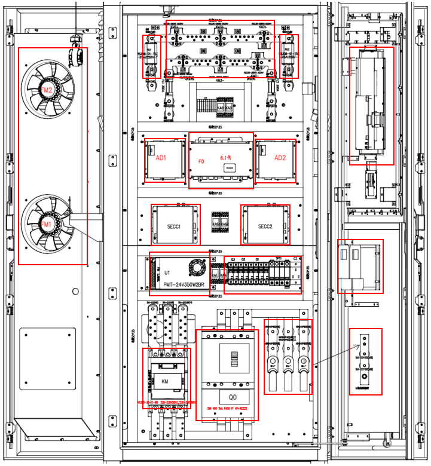
 

 

     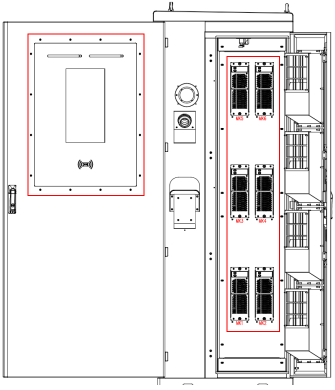
 

 

     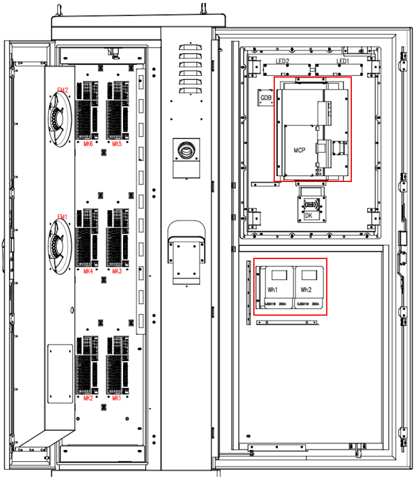
 

