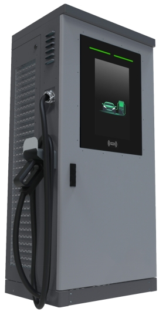
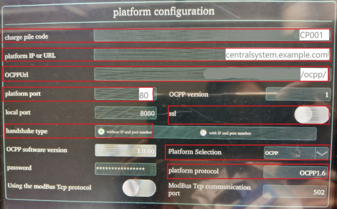
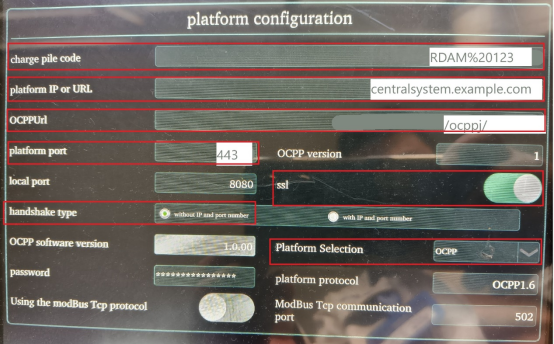
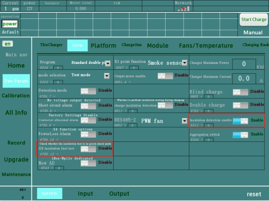
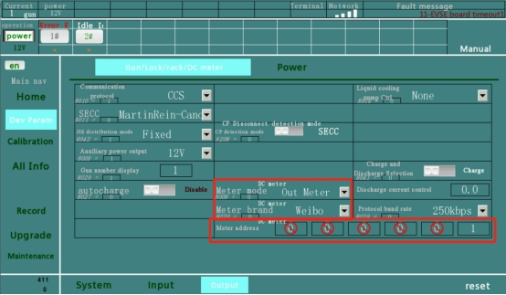
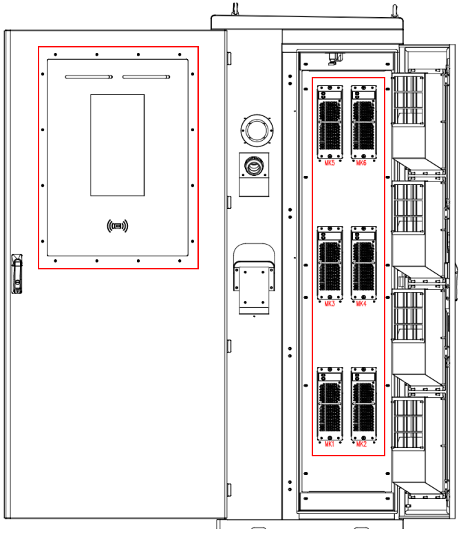
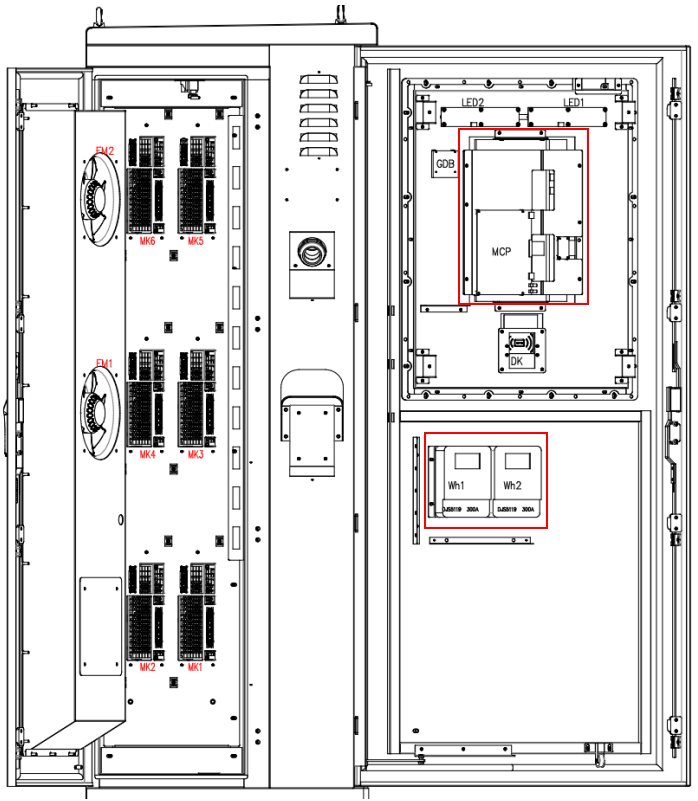

  

  <h1 align="center">
  罗宾森-六代-标准双枪-技术手册
</h1>

<a href="./README_en.md">English</a> | <a href="./README_zh.md">简体中文</a> | <a href="https://gitee.com/jiang-haiyang666/6th-generation-charger-user-manual">在线文档</a> | <a href="https://github.com/zhang-bei-hai-github/6th-generation-charger-user-manual/blob/master/README_en.md">Online documentation</a>

---

<table>
    <tr>
    	<td>
        	
        </td>
        <td>
        	<ul>
                <li>第六代充电机介绍</li>
                <li>安装使用说明书</li>
                <li>服务手册</li>
            </ul>
        </td>
    </tr>
</table>

你可以通过电子邮件联系我: [overseas@luobinsen.net](mailto:overseas@luobinsen.net)

## 充电机第一次上电如何使用

- 充电器应根据《安装操作手册》进行安装

- 打开屏幕背面的盖子

  `插入图片`

  

- 为TCU安装电池:
  - 建议使用可充电电池，电池型号为ML2032
  - 如不安装电池，设备断电后时间参数容易丢失, 每次重新上电时都需要校准时间

    

- 如果您要将充电机连接到中央系统，设备支持 以太网、SIM卡和WIFI连接网络，网线或SIM卡需要安装在屏幕背面。

  <table>
      <tr>
      	<th>以太网口</th>
          <th>SIM卡插槽</th>
      </tr>
      <tr>
      	<td></td>
          <td></td>
      </tr>
  </table>

  
- 恢复屏幕背面的盖子

  `插入图片`

- 检查充电机外部和内部各部件是否有损坏

- 检查所有螺钉无松动，交流断路器，交流接触器，交流铜排，直流接触器，保险丝，分流器，充电枪，交流铜排等

- 请根据充电器铭牌上的规格，测量L1、L2、L3与N之间的交流供电电压，确保其满足充电机的要求。同时，交流供电电缆的选择应遵循充电器安装文档中的指导。

- 闭合主断路器和所有微型断路器

- 在屏幕开启后设置日期和时间

  `插入图片`

- 请将充电连接机连接至车辆，然后使用卡片尝试开始充电

  <table>
      <tr>
      	<th>插枪连接</th>
          <th>刷卡充电</th>
      </tr>
      <tr>
      	<td></td>
          <td></td>
      </tr>
  </table>

## 连接充电机到中央系统的步骤

前往网络参数并更改以下参数

- 示例 1：
  - 对于标识为“CP001”的充电机，连接至具有 OCPP-J 终端 URL "ws://centralsystem.example.com/ocpp" 的中央系统时，对应的连接 URL 为：ws://centralsystem.example.com/ocpp/CP001

    

- 示例2：
  
  - 对于标识为“RDAM 123”的充电机，连接到具有 OCPP-J 终端 URL "wss://centralsystem.example.com/ocppj" 的中央系统，这将生成以下 URL：wss://centralsystem.example.com/ocppj/RDAM%20123
  
    翻译并优化后：
  
    对于标识为“RDAM 123”的充电机，连接至具有 OCPP-J 终端 URL "wss://centralsystem.example.com/ocppj" 的中央系统时，对应的连接 URL 为：wss://centralsystem.example.com/ocppj/RDAM%20123

    

- 注意：OCPP URL 的前后两端都应包含斜杠“/”

- 重置按钮位于制造商参数设置内

  `添加图片`

## 启动故障的分析与处理

### 电池端有电压/

- 现象: 充电机在启动时，它会检测车辆的电池电压。如果此时发现电池电压异常，可能意味着车辆直流接触器（用于连接或断开高压电路的关键部件）存在问题或CCM电压不准确

#### 解决方案

- **直流接触器故障**：
  - **直接测量车端充电接口：**使用万用表测量车辆直流输入接口，如果在不充电的情况下测量到电压，基本可以确认车辆直流接触器损坏，需更换。
- **CCM电压不准确，需要校准CCM AD电压**：CCM报告的电池电压与实际测量值不符，影响了充电过程的准确性。
  - 充电机在待机的情况下，充电枪不要与车辆连接
  - 连接调试屏进入校准界面
  - 选择对应的枪号，点击自动校准

    

### 绝缘检测故障

- **检查充电机直流输出的绝缘性能**

  - 使用专业设备：使用高阻表（兆欧表）或专用的绝缘测试仪来测量充电机直流输出端与地之间的绝缘电阻。
  - 参照标准：根据GB/T 18487.1-2015《电动汽车传导充电系统 第1部分：通用要求》，充电接口与车身之间的绝缘电阻应大于规定的最小值（例如，在潮湿条件下为1MΩ）。确保测试结果符合国家标准的要求。
  - 检查连接点：仔细检查所有连接点，包括电缆接头、插头插座等，确保没有松动、腐蚀或损坏的情况。
  - **线缆破损**：如果发现电缆外皮有破损或内部导线裸露，应及时更换受损的线缆。
  - **接触不良**：对于任何接触不良的地方，重新紧固连接件，并清理氧化物或其他污染物。
  - **密封问题**：检查充电机外壳及其他组件的密封情况，防止水分或湿气侵入导致绝缘下降。

- **检查充电模块是否正常**：通过模拟负载或实际车辆进行充电测试，观察充电模块的工作状态，如输出电压电流是否稳定，是否有不工作的模块或模块组，如模块异常需排查充电模块或更换充电模块。

- **如果CCM电压不准确，则需要校准CCM的AD电压**

  - 参考`电池有电压校准方法`

  

      
  

### 接触器未打开

#### 接触器本身故障或控制电路问题

##### 可能原因

- **接触器硬件故障**：接触器内部的机械或电气组件可能已经损坏，导致无法正常工作。
- **控制电路问题**：驱动接触器的控制信号可能未能正确传输，可能是由于线缆断裂、连接松动、控制器故障等原因。

#### 检查接触器的电源和控制线是否正常连接

- **物理检查**：首先进行视觉检查，确保所有电线和接头没有松动、腐蚀或物理损伤。特别注意接触器的电源线和控制线。
- **连续性测试**：使用万用表检查电源线和控制线的连续性，确保没有断路或短路现象。
- **电压测量**：在不带电的情况下，确认接触器的线圈两端是否有正确的电源电压（通常是24V DC或12V DC，具体取决于型号）。

#### 确认控制系统给出的信号是否正确，并检查是否有足够的电压驱动接触器

- **信号验证**：使用示波器或多用途万用表测量控制信号的波形和电压水平，确保控制系统发出的信号符合接触器的要求。对于电磁接触器，通常需要一个脉冲信号来触发闭合动作。
- **模拟测试**：如果可能的话，尝试手动施加一个标准的控制信号到接触器，观察其反应。这可以帮助判断问题是出在控制系统还是接触器本身。
- **负载测试**：在安全条件下，给接触器施加适当的负载，检查它能否承受并保持闭合状态。如果接触器能够在无负载情况下正常工作但在实际负载下失败，可能存在过载保护或其他相关问题。

#### 如果是硬件问题，考虑更换接触器

- 确保新接触器与原设备规格完全匹配，包括额定电流、电压、尺寸等参数
- 完成安装后，进行全面的功能测试，确保新接触器能够正常工作并与整个系统兼容

### 1802/1806 报文超时

- 检查充电枪与车辆充电插座之间的连接是否稳固，确保没有松动或接触不良。
- 使用万用表或其他测试工具检查充电枪与车辆之间的CAN总线电路是否有断裂、短路或屏蔽层破损等问题。
- 检查充电机内部的通信控制器（如CCM、SECC）是否存在硬件故障，必要时更换损坏的组件。
- 怀疑存在通信协议兼容性问题，请联系厂家提供技术支持。

### 电池反接故障

- GBT 充电机不检测车辆电池电压
- 使用万用表或其他测试工具直接测量电池两端的实际电压，并与充电机报告的电压进行对比。如果发现差异，考虑重新校准电压或更换电压检测的硬件。
- 仔细检查所有相关线缆和接头，确保没有松动、腐蚀或物理损伤。特别是注意电压检测线是否完好无损。

### 1811 报文超时

- **1811报文**：充电机发送给BMS的充电参数配置报文，包含充电过程中所需的关键参数，如最大允许充电电流、充电电压上限等。
- **响应报文**：BMS接收到1811报文后，会回复确认报文，表示已经接收并处理了这些参数。

- 检查充电枪与车辆充电插座之间的连接是否稳固，确保没有松动或接触不良。
- 使用万用表或其他测试工具检查充电枪与车辆之间的CAN总线电路是否有断裂、短路或屏蔽层破损等问题。
- 检查充电机内部的通信控制器（如CCM、SECC）是否存在硬件故障，必要时更换损坏的组件。
- 怀疑存在通信协议兼容性问题，请联系厂家提供技术支持。

### 1009

- **1009报文**：充电机定期发送给BMS的心跳报文，用于确认通信链路状态。通常情况下，BMS会在接收到1009报文后立即回复一个确认报文。
- **作用**：心跳报文的作用类似于“健康检查”，它确保了充电机和BMS之间的持续通信，可以及时发现并处理通信异常。
- 检查充电枪与车辆充电插座之间的连接是否稳固，确保没有松动或接触不良。
- 使用万用表或其他测试工具检查充电枪与车辆之间的CAN总线电路是否有断裂、短路或屏蔽层破损等问题。
- 检查 SECC 是否存在硬件故障，必要时更换损坏的组件。
- 怀疑存在通信协议兼容性问题，请联系厂家提供技术支持。

### 握手超时

- **1802报文**：充电机发送给BMS的握手请求报文，用于确认双方是否准备好开始充电。
- **1806报文**：BMS回复给充电机的握手响应报文，表示车辆已经准备好接受充电，并提供必要的参数信息（如最大允许充电电流等）。
- **其他相关报文**：根据具体实现，可能会有额外的报文用于进一步确认或配置。
- 检查充电枪与车辆充电插座之间的连接是否稳固，确保没有松动或接触不良。
- 使用万用表或其他测试工具检查充电枪与车辆之间的CAN总线电路是否有断裂、短路或屏蔽层破损等问题。
- 检查 SECC 是否存在硬件故障，必要时更换损坏的组件。
- 怀疑存在通信协议兼容性问题，请联系厂家提供技术支持。

### BMS 其他消息超时

- **充电参数配置报文（如1811报文）**：用于设置充电参数。
- **充电状态报告报文**：BMS向充电机报告当前充电状态及电池参数。
- **故障诊断报文**：用于传递故障信息和诊断结果。
- **心跳报文（如1009报文）**：用于确认通信链路状态。
- **结束充电报文**：通知充电机停止充电。
- 检查充电枪与车辆充电插座之间的连接是否稳固，确保没有松动或接触不良。
- 使用万用表或其他测试工具检查充电枪与车辆之间的CAN总线电路是否有断裂、短路或屏蔽层破损等问题。
- 检查 SECC 是否存在硬件故障，必要时更换损坏的组件。
- 怀疑存在通信协议兼容性问题，请联系厂家提供技术支持。

### 连接器断开并终止

- 禁用`日标绝缘快速测试`，启用`绝缘检测启用`

    <table style="width: 100%; table-layout: fixed; border-collapse: collapse;">
        <tr>
        	<td style="width: 70%; padding: 8px; text-align: left; border: 1px solid black;">
            	
            </td>

- AD板是快速检查板，选择启用。
- AD板不是快速检测板，选择禁用。
- 是否为快速检查AD取决于AD板内部是否有白色继电器。无需拆卸外壳，从底部向内查看即可确认。

### 接触器未闭合或短路故障

- 检查直流接触器
- CCM 电压不准确，需要校准 CCM AD 电压

### 异常检测电压范围

- 充电机的输出电压范围（200-1000V）不足以满足车辆需求，车辆无法在此充电机上充电

### 旧标准（GB/T 和本地区域）禁用的充电机不支持

- 充电机的通信协议不符合车辆要求

### SOC 无法达到

- 充电机的通信协议不符合车辆要求

### 电池电压高于充电机最大输出电压

- 充电机的输出电压范围（200-1000V）不足以满足车辆需求，车辆无法在此充电机上充电

### 异常电池电压 - 超出BCP消息中的当前电池电压范围

- 充电机的输出电压范围（200-1000V）不足以满足车辆需求，车辆无法在此充电机上充电

 

### 控制命令停止

- CMS已向充电机发送了停止命令，请检查CMS

 

### 鉴权失败

- 用户ID在CMS中不存在、已过期或被冻结

 

### BMS 启动时故障

- 充电机与车辆通信错误，尝试更换 SECC

 

### 过压故障

- 检查充电机输出电压
- CCM 电压不准确，需要校准 CCM AD 电压

 

### 绝缘检测升压失败

- 检查充电模块是否正常工作
- CCM 电压不准确，需要校准 CCM AD 电压

 

### 接收国网TCU消息 CMD12 的确认结果失败

- 更换 TCU

 

### TCU 正常停止

- 更换 TCU

 

### 由于充电控制器故障导致 TCU 充电控制单元停止

- 更换 TCU

 

### TCU 充电控制单元与充电控制器之间的通信故障

- 检查 CCM 电源
- 检查并更换 TCU 和 CCM 之间的网络电缆
- 更换 CCM

 

### TCU 读卡器通信故障

- 检查读卡器及其线束
- 更换读卡器

 

### TCU 与电表设备之间的通信故障

- 检查电表电源
- 更换电表

 

### TCU ESAM 故障

- 更换 TCU

 

### TCU 计量数据验证异常

- 检查并更换直流电能表

 

### TCU 其他故障停止

- 由于未知原因，请联系供应商检查

 

### TCU 通信异常

- 检查并更换 TCU

 

### 车辆启动 BRO 消息异常

- 检查并更换 SECC

 

### 通道未充电 TUTEL

- 特定于 TUTEL 的协议

 

### 连接器充电停止

- 检查充电枪与车辆之间的连接或更换充电枪

### 急停停止故障

- 紧急停止按钮已被按下且无异常，请恢复它。

 

### 门开故障

- 门处于打开状态。请将其关闭。
- 检查门限位开关

 

### 直流电表通信故障

- 检查直流电能表的电源
- 检查直流电能表的通信线束
- 检查直流电表地址

    

- 更换直流电表

 

### 与 CCM 通信超时

- 检查 CCM 电源
- 检查并更换 TCU 和 CCM 之间的网络电缆
- 检查 CCM 的参数

<table>
    <tr>
    	<td>
        	
        </td>
        <td>
        	
        </td>
    </tr>
</table>

- 更换CCM

### 无充电故障

- 请联系供应商检查

 

### 熔断器故障

- 检查熔断器

 

### 避雷器故障

- 检查或更换 SPD（电涌保护器）

 

### 端子板异常

- 检查 FZ 电源
- 检查 FZ 通信线束
- 更换 FZ

 

### 交流/直流控制器故障

- 请联系供应商检查

 

### 空调控制器故障

- 检查空调控制板的电源
- 检查空调控制板的通信线束
- 更换空调控制板

 

### AD 单元通信模块故障

- 检查 AD 地址是否正确
- 检查 AD 的电源
- 检查 AD 通信线束
- 更换 AD 单元

 

### 所有空调故障

- 检查所有空调的电源
- 检查所有空调的通信线束
- 可能所有空调都已损坏

 

### 风速过大

- 风力过强，请等待风力减弱
- 风速计可能已损坏

 

### 主断路器电气操作故障

- 主断路器或电操作已损坏，需要更换。

 

### SDV 故障

- SDV 已损坏，需要更换。

 

### 计量装置故障

- 更换直流电能表

 

### 主断路器电气操作无电源操作故障

- 检查主断路器的电源供应
- 主断路器已损坏，需要更换。

 

### 维护中

- 充电机处于服务模式，请注意服务按钮的状态

 

### FLASH 故障

- CCM 中间的 FLASH 板已损坏，需要更换。

 

### RAM 故障

- CCM 中间的 RAM 已损坏，需要更换。

 

### SECC_PLC 通信故障

- 检查 SECC 的电源
- 检查 SECC 和 CCM 之间的通信电缆
- 更换 SECC

### 并联接触器故障或模块端子电压异常

- 检查或更换中间接触器
- CCM 电压不准确，需要校准 CCM AD 电压

 

### 烟雾传感器故障

- 机柜内有火警或烟雾
- 烟雾探测器已损坏

 

### 电子锁故障

- GBT 充电枪电子锁异常

 

### 机柜温度过高故障

- 机柜内温度过高，需要停止并冷却充电机
- 温度传感器已损坏

 

### 通道特定远程控制超时

- 请联系供应商检查

 

### 实时钟 RTC 故障

- 需要安装 TCU 的电池
- 需要校准时间
- TCU 已损坏，请更换 TCU

 

### CCM 进入开始充电

- 充电机与车辆正在通信中，请等待

 

### CCM 进入充电超时

- 充电机与车辆之间的通信故障
- 检查并更换 SECC

 

### VIN 获取失败

- 检查交流电源
- 检查交流接触器
- 检查充电模块

 

### 输出短路

- 充电机输出短路，请检查充电机或车辆是否短路

### 输入缺相

- 交流输入相序错误，请调整为正确的相序

### 输入过压

- 输入交流电压高于充电机的交流电压范围
- 检查 CCM 的参数

    

### 输入欠压

- 输入交流电压低于充电机的交流电压范围
- 检查 CCM 的参数

### 绝缘模块通信故障

- 请联系供应商检查

输入绝缘故障

- 请断开电源并检查输入绝缘

### BMS 通信模块故障

- 请联系供应商检查

### 火灾警报

- 请检查灭火器。

### 其他未知原因

- 请联系供应商检查。

### 子锁反馈异常

- 充电枪电子锁异常，请更换充电枪。

### 直流接触器异常

- 直流接触器损坏，请更换直流接触器。

### 直流预充电故障

- 请检查充电模块。
- 请检查 CCM 的 AD 电压值并进行校准。

### 输入绝缘自检异常

- 输入绝缘自检板异常，请更换。

### 输出绝缘自检异常

- 输出绝缘自检板异常，请更换。

### 启动过程中手动关闭

- 启动过程中停止

### 启动过程中刷卡关闭

- 启动过程中由刷卡停止

### 启动过程中远程关闭

- 启动过程中的远程停止

### 电源丢失

- 输入电源突然切断

### 接地检测功能通信故障

- 检查接地检测器的电源
- 检查接地检测器的通信线束

### 接地故障

- 接地线错误，请检查接地线是否牢固连接

### 缺相警报

- 检查输入是否缺相

##  故障分析与处理

### 紧急停止故障

- 紧急停止按钮已被按下且无异常，请恢复。

### 并联接触器故障或模块端子电压异常

- 查或更换中间接触器
- CCM 电压不准确，需要校准 CCM AD 电压

### 直流计量通信故障

- 检查直流电能表的电源
- 检查直流电能表的通信线束
- 检查直流电表地址

### 与 CCM 通信超时

- 检查 CCM 电源
- 检查并更换 TCU 和 CCM 之间的网络电缆
- 检查 CCM 的参数

### 机柜温度过高故障

- 机柜内温度过高，需要停止并冷却充电机
- 温度传感器已损坏

### CCS2 通信模块故障

- 检查 SECC 的电源
- 检查 SECC 和 CCM 之间的通信电缆
- 更换 SECC

### 门开故障

- 门处于打开状态。请将其关闭。
- 检查门限位开关

### 无充电故障

- 请联系供应商检查

### 熔丝故障

- 检查熔丝

### 避雷器故障

- 检查或更换 SPD（电涌保护器）

### 端子板异常

- 检查 FZ 电源
- 检查 FZ 通信线束
- 更换 FZ

### AC/DC 控制器故障

- 请联系供应商检查

### 空调控制器故障

- 检查空调控制板的电源
- 检查空调控制板的通信线束
- 更换空调控制板

### AD 单元通信模块故障

- 检查 AD 地址是否正确
- 检查 AD 的电源
- 检查 AD 通信线束
- 更换 AD 单元

### 空调故障

- 检查空调的电源
- 检查空调通信线束
- 更换空调

### 风速过大

- 风力过强，请等待风力减弱。
- 风速计可能已损坏。

### 主断路器电气操作故障

- 主断路器已损坏，需要更换。

### SDV 故障

- SDV 已损坏，需要更换。

### 计量装置故障

- 更换直流电能表

### 无电源异常运行

- 检查交流接触器是否闭合

### 维护状态

- 充电机处于服务模式，请注意服务按钮的位置

### 烟雾传感器故障

- 机柜内有火警或烟雾
- 烟雾探测器已损坏

电子锁故障

- GBT 充电枪电子锁异常
- 更换充电枪

### 实时钟 RTC 故障

- 需要安装 TCU 的电池
- 需要校准时间
- TCU 已损坏，请更换 TCU

### CCM 程序故障

- 更换 SECC

### 输出短路

- 充电机输出短路，请检查充电机或车辆是否短路

### 输入缺相

- 交流输入相序错误，请调整为正确的相序

### 输入过压

- 输入交流电压高于充电机的交流电压范围
- 检查 CCM 的参数

### 输入欠压

- 输入交流电压低于充电机的交流电压范围
- 检查 CCM 的参数

### 绝缘模块通信故障

- 请联系供应商检查

### 输入绝缘故障

- 请断开电源并检查输入绝缘

### BMS 通信模块故障

- 请联系供应商检查

### FLASH 故障

- CCM 中间的 FLASH 板已损坏，需要更换

### RAM 故障

- CCM 中间的 RAM 已损坏，需要更换

### 火灾警报

- 请检查灭火器

### 其他未知原因

- 请联系供应商检查

### 输出接触器故障

- 检查或更换直流接触器

### 输入绝缘自检故障

- 输入绝缘自检板异常，请更换。

### 输出绝缘自检故障

- 输出绝缘自检板异常，请更换。

### 电源丢失

- 输入电源突然切断

### 接地检测功能通信故障

- 检查接地检测器的电源
- 检查接地检测器的通信线束

### 接地故障

- 接地线错误，请检查接地线是否牢固连接

### 缺相警报

- 检查输入是否缺相

## 交易异常停止的分析与处理

### BMS 超时

- 检查并更换 SECC
- 检查并更换 CCM

### 超时或未知原因流程错误

- 检查并更换 SECC
- 检查并更换 CCM

### BMS 绝缘故障

- 检查充电机直流输出的绝缘情况
- 检查充电模块

### BMS 输出连接器过温

- 检查充电枪温度并更换充电枪
- 检查车辆插座是否损坏，必要时更换插座

### BMS 元件输出连接器过温

- 检查充电枪温度并更换充电枪
- 检查车辆插座是否损坏，必要时更换插座

### BMS 连接器故障

- 检查并更换充电枪
- 检查车辆插座是否损坏，必要时更换插座

### BMS 电池组温度高

- 车辆电池性能问题

### BMS 其他故障

- 请联系供应商检查

### BMS 过流

- 检查充电机输出电流

### BMS 电压异常

- 检查充电机输出电压

### BMS 高压继电器故障

- 车辆直流接触器损坏

### BMS 检测点故障

- 检查充电枪是否牢固连接

### BMS 达到请求 SOC

- 正常停止或车辆 SOC 问题

### BMS 达到总电压设定值输出过电压警告

- 检查 CCM 的 AD 电压值并进行校准

### BMS 达到单元电压设定值

- 正常停止或电池性能问题

### BMS 二级报警：动力电池单元电压过高

- 正常停止或电池性能问题

### BMS 二级报警：动力电池单元电压过低

- 正常停止或电池性能问题

### BMS SOC 过高

- 正常停止或电池性能问题

### BMS SOC 过低

- 电池性能问题

### BMS 充电过流

- 检查充电机输出电流

### BMS 电池温度过高

- 电池性能问题

### BMS 电池绝缘异常

- 检查充电机或车辆的绝缘情况

### BMS 连接状态异常

- 检查充电枪是否牢固连接到车辆
- 更换充电枪或车辆插座

### BMS 无充电或控制点电流在10分钟内过低

- 输出电流低或无输出电流
- 检查直流接触器
- 检查熔丝
- 检查交流电源
- 检查交流接触器
- 检查充电模块
- 检查直流电能表

### 手动停止

- 屏幕上的停止按钮被按下

### 达到请求后停止

- 充满或电池性能问题

### 账户余额不足停止

- 用户余额不足，需要从CMS充值

### 请求电压超过最大电压

- 充电机的输出电压范围（200-1000V）不足以满足车辆需求，车辆无法在此充电机上充电。

### 请求电压低于最小电压

- 充电机的输出电压范围（200-1000V）不足以满足车辆需求，车辆无法在此充电机上充电。

### 单个电池单元过温

- 车辆电池性能问题

### 电池温度过高

- 车辆电池性能问题

### 远程停止

- CMS 控制的充电停止

### 无充电电流超出允许时间

- 输出电流低或无输出电流
- 检查直流接触器
- 检查熔丝
- 检查交流电源
- 检查交流接触器
- 检查充电模块
- 检查直流电能表

### 刷卡停止充电

- 已通过刷卡指令停止充电

### 连接器拔出停止充电

- 充电过程中连接器断开导致停止
- 检查或更换充电枪

### 连接器温度过高

- 检查或更换充电枪
- 从参数中检查充电枪的温度

### 断开连接器

- 充电过程中连接器断开导致停止
- 检查或更换充电枪

### 充电机检测到绝缘故障停止

- 检查充电机直流输出的绝缘情况
- 检查充电模块

### 接收国网TCU消息 CMD12 的确认结果失败

- Replacement of TCU

### TCU 正常停止

- 更换 TCU

### TCU 充电控制单元因充电控制器故障停止

- TCU 充电控制单元因充电控制器故障停止

### TCU 充电控制单元与充电控制器之间的通信故障

- 检查 CCM 电源
- 检查并更换 TCU 和 CCM 之间的网络电缆
- 更换 CCM

### TCU 与计量设备之间的通信故障

- 检查电表电源
- 更换电表

### TCU ESAM 故障

- 更换 TCU

### TCU 计量数据验证异常

- 检查并更换直流电能表

### TCU 因其他故障停止

- 请联系供应商检查

### TCU 通信故障停止

- 请联系供应商检查

### 最大电流超出故障

- 检查并更换 TCU

### 通道停止充电

- 请联系供应商检查

### 因充电电流低于 0.5A 持续 5 分钟而停止充电

- 输出电流低或无输出电流
- 检查直流接触器
- 检查熔丝
- 检查交流电源
- 检查交流接触器
- 检查充电模块
- 检查直流电能表

### 从属停止（副枪未启动）

- 在使用双枪为车辆充电时，第二个连接器未能启动

### 紧急停止故障

- 紧急停止按钮已被按下且无异常，请恢复它。

### 门开故障

- 门处于打开状态。请将其关闭。
- 检查门限位开关

### 直流计量通信故障

- 检查直流电能表的电源
- 检查直流电能表的通信线束
- 检查直流电表地址

### 与 CCM 通信超时

- 检查 CCM 电源
- 检查并更换 TCU 和 CCM 之间的网络电缆
- 检查 CCM 的参数

### 无充电故障

- 请联系供应商检查

### 熔丝故障

- 检查熔丝

### 避雷器故障

- 检查或更换 SPD（电涌保护器）

### 端子板异常

- 检查 FZ 电源
- 检查 FZ 通信线束
- 更换 FZ

### 交流/直流控制器故障

- 请联系供应商检查

### 空调控制器故障

- 检查空调控制板的电源
- 检查空调控制板的通信线束
- 更换空调控制板

### AD 单元通信模块故障

- 检查 AD 地址是否正确
- 检查 AD 的电源
- 检查 AD 通信线束

### 空调故障

- 检查空调控制板的电源
- 检查空调控制板的通信线束
- 更换空调控制板

### 风速过大

- 风力过强，请等待风力减弱。
- 风速计可能已损坏。

### 主断路器电气操作故障

- 主断路器已损坏，需要更换。

### SDV 故障

- SDV 已损坏，需要更换。

### 计量装置故障

- 更换直流电能表

### 主断路器电气操作无电源操作故障

- 检查主断路器的电源供应
- 主断路器已损坏，需要更换。

### 维护中

- 充电机处于服务模式，请注意服务按钮的位置。

### 烟雾传感器故障

- 机柜内有火警或烟雾

### 电子锁故障

- GBT 充电枪电子锁异常

### SECC_PLC 通信异常

- 检查 SECC 的电源
- 检查 SECC 和 CCM 之间的通信电缆
- 更换 SECC

### 机柜温度过高故障

- 机柜内温度过高，需要停止并冷却充电机
- 温度传感器已损坏

### 通道特定远程控制超时

- 请联系供应商检查

### 实时钟 RTC 故障

- 需要安装 TCU 的电池
- 需要校准时间
- TCU 已损坏，请更换 TCU

### 活动时间到达

- 在设定时间停止

### 认证异常（应用序列号 USID 异常）

- 请联系供应商检查

### 计量异常停止：起始功率大于结束功率

- 请联系供应商检查

### 最大充电时间达到 12 小时

- 充电持续时间超过 12 小时将停止

### 时间记录 - 开始时间故障

- 交易开始时间错误

### 硬重置完成

- CMS 发送硬重置指令

### 软重置完成

- CMS 发送软重置指令

### 因网络故障停止充电

- 请联系供应商检查

### 因计量故障停止充电

- 检查并更换直流电能表

### 输出短路

- 充电机输出短路，请检查充电机或车辆是否短路

### 输入交流缺相

- 交流输入相序错误，请调整为正确的相序

### 输入交流过压

- 输入交流电压高于充电机的交流电压范围

### 输入交流欠压

- 输入交流电压低于充电机的交流电压范围

### 绝缘模块通信故障

- 请联系供应商检查

### 输入绝缘故障

- 请断开电源并检查输入绝缘

### BMS 通信模块故障

- 请联系供应商检查

### 掉电

- 输入电源突然切断

### 火灾警报

- 请检查灭火器。

### BMS 终止

- 正常停止或电池性能问题

### 因未知原因停止

- 请联系供应商检查

### 直流接触器异常

- 直流接触器损坏，请更换直流接触器

### 并联接触器异常

- 检查或更换中间接触器

### 输出电流超过控制电流异常

- 检查输出电流

### 输入绝缘自检故障停机

- 输入绝缘自检板异常，请更换

### 输出绝缘自检故障停机

- 输出绝缘自检板异常，请更换

### 接地检测功能通信故障

- 检查接地检测器的电源
- 检查接地检测器的通信线束

### 接地故障

- 接地线错误，请检查接地线是否牢固连接

### 缺相警报

- 检查输入是否存在缺相

## 保养

## 附录 Ⅰ

 

     
 

 

     
 

 

     
 

